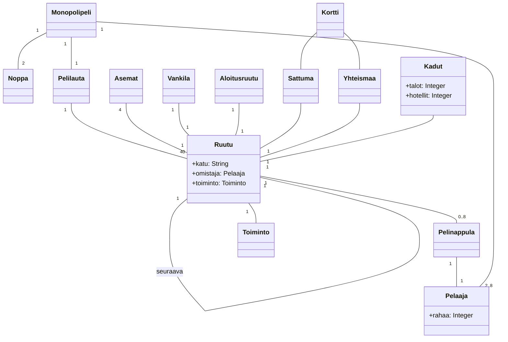

```mermaid
 classDiagram
    Monopolipeli "1" -- "2" Noppa
    Monopolipeli "1" -- "1" Pelilauta
    Pelilauta "1" -- "40" Ruutu
    Ruutu "1" -- "1" Ruutu : seuraava
    Ruutu "1" -- "0..8" Pelinappula
    Pelinappula "1" -- "1" Pelaaja
    Pelaaja "2..8" -- "1" Monopolipeli
    Ruutu "1" -- Toiminto
    Asemat "4" -- "1" Ruutu
    Vankila "1" -- "1" Ruutu
    Aloitusruutu "1" -- "1"Ruutu
    Sattuma -- "1" Ruutu
    Yhteismaa -- "1" Ruutu
    Kadut -- "1" Ruutu
    Kortti -- Sattuma
    Kortti -- Yhteismaa

class Pelaaja {
    +rahaa: Integer
}

class Kadut {
    +talot: Integer
    +hotellit: Integer
}

class Ruutu {
    +katu: String
    +omistaja: Pelaaja
    +toiminto: Toiminto
}
```
