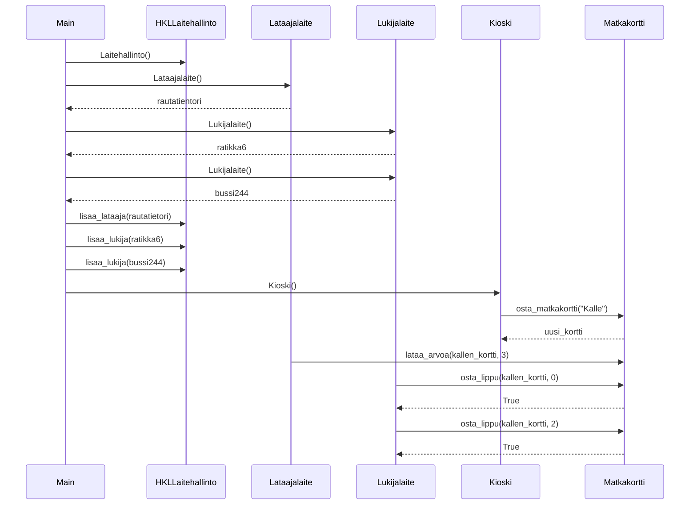

```mermaid
sequenceDiagram
    participant Main
    participant HKLLaitehallinto
    participant Lataajalaite
    participant Lukijalaite
    participant Kioski
    participant Matkakortti
    Main ->>  HKLLaitehallinto: Laitehallinto()
    Main ->> Lataajalaite: Lataajalaite()
    Lataajalaite -->> Main: rautatientori
    Main ->> Lukijalaite: Lukijalaite()
    Lukijalaite -->> Main: ratikka6
    Main ->> Lukijalaite: Lukijalaite()
    Lukijalaite -->> Main: bussi244
    Main->>HKLLaitehallinto: lisaa_lataaja(rautatietori)
    Main->>HKLLaitehallinto: lisaa_lukija(ratikka6)
    Main->>HKLLaitehallinto: lisaa_lukija(bussi244)
    Main ->> Kioski: Kioski()
    Kioski->>Matkakortti: osta_matkakortti("Kalle")
    Matkakortti-->>Kioski: uusi_kortti
    Lataajalaite->>Matkakortti: lataa_arvoa(kallen_kortti, 3)
    Lukijalaite->>Matkakortti: osta_lippu(kallen_kortti, 0)
    Matkakortti-->>Lukijalaite: True
    Lukijalaite->>Matkakortti: osta_lippu(kallen_kortti, 2)
    Matkakortti-->>Lukijalaite: True
```
