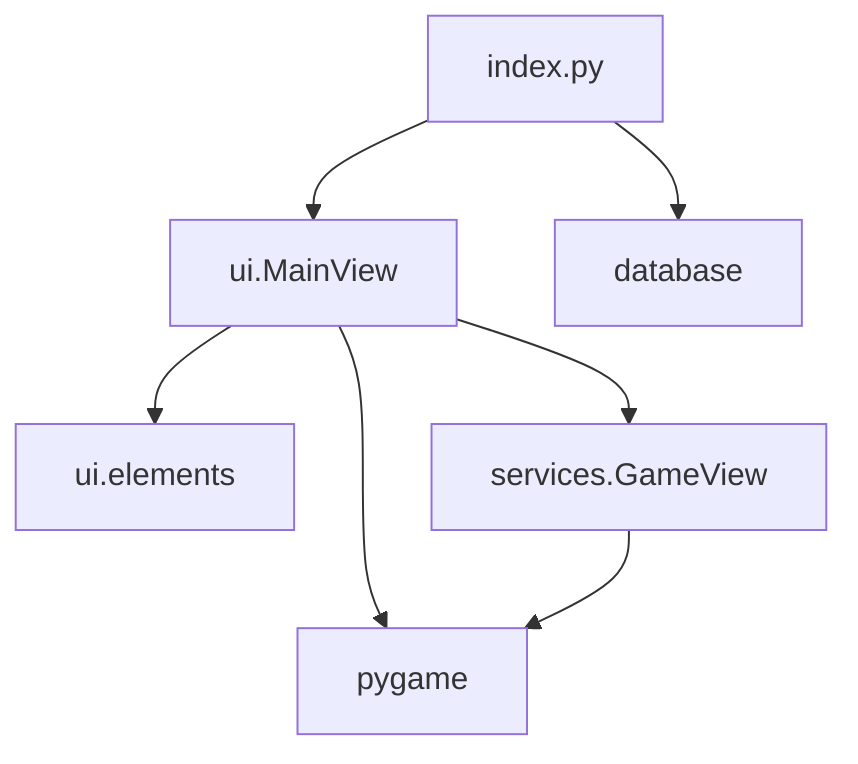

## UML-kaavio (alustava / tämän hetkinen)

```mermaid
graph TD;
    index.py --> ui.MainView;
    index.py --> database;
    ui.MainView --> pygame;
    ui.MainView --> ui.elements;
    ui.MainView --> services.GameView;
    services.GameView --> pygame;
```
