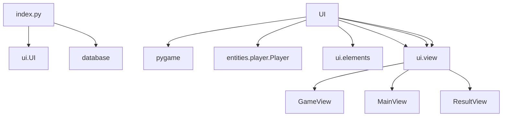
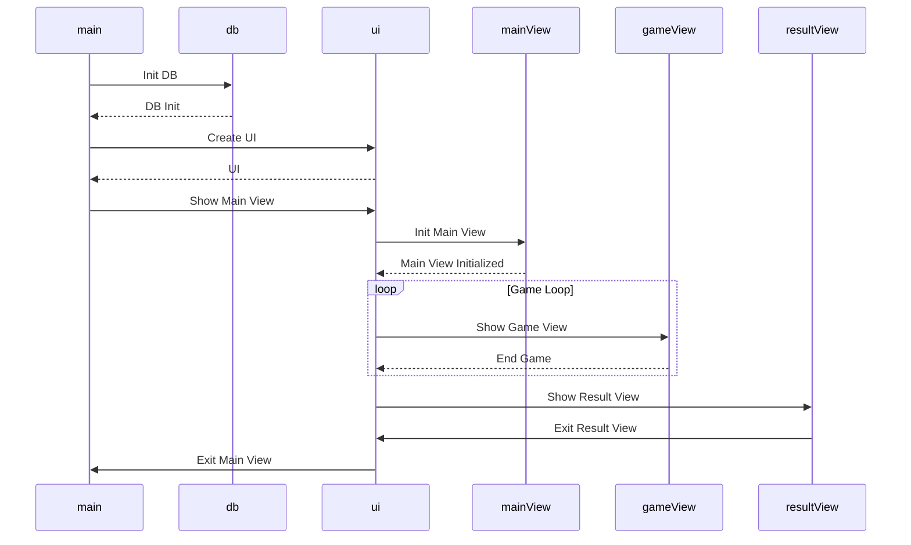

## pakkauskaavio (alustava)

## sekvenssikaaivo (alustava)

## Päätoiminnallisuus

1. Pelaajalle näytetään aluksi "Main View"-näkymä.
2. Pelaajalle luodaan Player-olio, joka pitää kirjaa pelaajan pelitiedoista (elämät, pisteet, nykyinen combo, pisin combo).
3. Kun pelaaja käynnistää pelin "Play"-painikkeesta, pelaaja siirtyy "Game View"-näkymään, jonka aikana pelaajan tulee osua mahdollisimman moneen sound-block pelin aikana ennen kuin elämät loppuvat (alustavasti 3 elämää)
4. Pelin aikana pelaaja näkee pisteensä vasemmasta yläkulmasta ja pisimmän combonsa
5. Kun pelaajan elämät loppuvat pelaajalle näytetään "Result View", josta pelaaja näkee pistetuloksensa.
6. Kun pelaaja sulkee ikkunan ohjelma palaa "Main View"-näkymään ja pelaajan tilastot nollataan.
7. Pelaaja pystyy nyt käynnistymään uuden pelin tai lopettamaan ohjelman oikeasta yläkulmasta.

