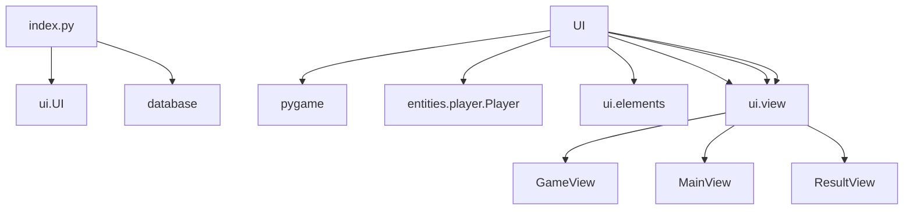
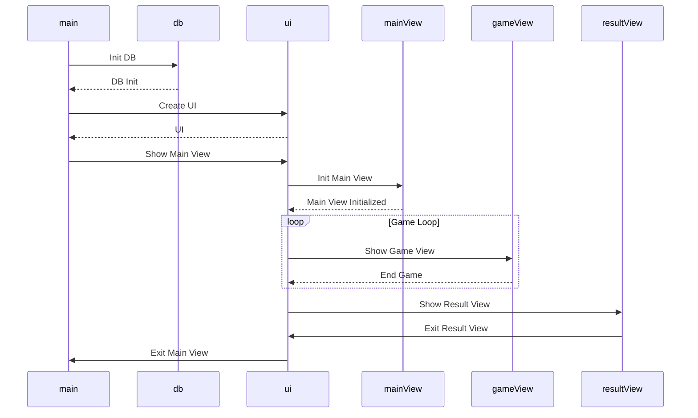

## pakkauskaavio (alustava)

```mermaid
graph TD;
    index.py --> ui.UI;
    index.py --> database;
    UI --> pygame;
    UI --> entities.player.Player
    UI --> ui.elements
    UI --> ui.view --> GameView;
    UI --> ui.view --> MainView;
    UI --> ui.view --> ResultView
```

## sekvenssikaaivo (alustava)

```mermaid
sequenceDiagram
    participant main
    participant db
    participant ui
    participant mainView
    participant gameView
    participant resultView

    main ->> db: Init DB
    db -->> main: DB Init
    main ->> ui: Create UI
    ui -->> main: UI
    main ->> ui: Show Main View
    ui ->> mainView: Init Main View
    mainView -->> ui: Main View Initialized
    loop Game Loop
        ui ->> gameView: Show Game View
        gameView -->> ui: End Game
    end
    ui ->> resultView: Show Result View
    resultView ->> ui: Exit Result View
    ui ->> main: Exit Main View
```
